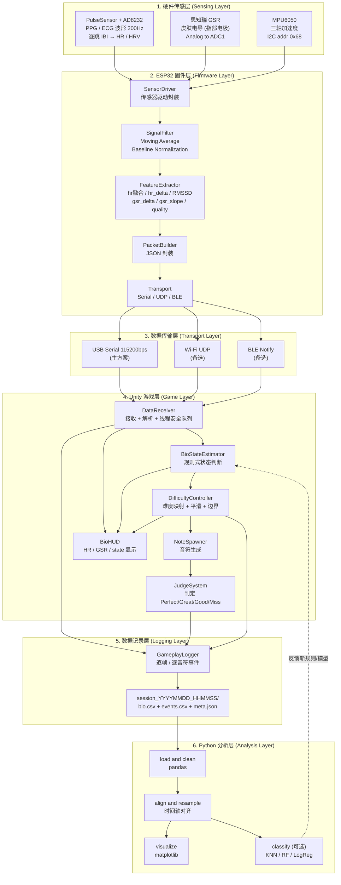

# ARCHITECTURE.md

# 生理信号自适应音乐节奏游戏 — 系统架构文档

> Bio-Adaptive Rhythm Game — 以 ESP32 读取心率/HRV（PulseSensor + AD8232 ECG）与皮肤电（思知瑞 GSR 模块），实时串流至 Unity 4 轨节奏游戏，依玩家生理状态动态调整难度，并用 Python 做赛后分析。
>
> 文档版本：v0.4
> 适用课程：20 小时授课 + 4–6 小时课外数据采集
>
> **v0.2 变更（按实际采购硬件更新）**：
> - 心率传感器确定为 **DFRobot Gravity MAX30102（SKU: SEN0518）**——带板载算法，直接输出 HR/SpO2/温度，**每 4 秒更新**，无原始 PPG → 固件删除峰值检测模块，**HRV 特征取消**，JSON schema 中 `hrv` 字段替换为 `spo2` 与 `temp`
> - 运动传感器由 MPU6050 改为 **DFRobot Gravity I2C LIS2DH（SKU: SEN0224）**（仅加速度，无陀螺仪，对本项目足够）
> - 因心率更新慢（4 秒），**GSR 成为快速情绪通道，HR 作为慢速趋势通道**，状态规则相应调整
> - 元件详细介绍见 [HARDWARE.md](HARDWARE.md)
>
> **v0.3 变更（新增 HRV 实验支线 + 固件开工）**：
> - 新购 **AD8232 心电模块**、**PulseSensor 光电脉搏**、**裸 MAX30100**，构成「HRV 实验支线」：主线状态判断仍用 SEN0518 + GSR + LIS2DH；支线负责数据集采集与 HRV（RMSSD）特征——ECG 为逐跳间隔金标准，缓解 R11（SEN0518 无 HRV）
> - MAX30100 与 SEN0518 同为 I2C 地址 `0x57` → 采用 **ESP32 双 I2C 总线**：总线0（GPIO21/22）挂 LIS2DH + MAX30100（选配），总线1（GPIO25/26）挂 SEN0518
> - Phase 1 数据采集固件已建立：见 [firmware/](firmware/)（含 `tools/serial_logger.py` 数据集记录器与 `tools/plot_session.py`）
>
> **v0.4 变更（硬件定稿：移除 SEN0518 与 LIS2DH，改用 MPU6050）**：
> - 心率不再依赖板载算法黑盒：**PulseSensor 为游戏实时心率主力，AD8232 ECG 为金标准**，固件融合为统一 `hr`（优先级 ECG > PPG > MAX30100）——**4 秒延迟问题（R11）随 SEN0518 移除而消失，HRV（RMSSD）进入主线数据流**
> - 运动传感器改为 **MPU6050**（I2C `0x68`，固件内置最小驱动）；0x57 地址冲突消失，**单条 I2C 总线**即可
> - 失去 SpO2 佩戴质量检测 → quality bit0 改为「心搏新鲜度」（3 秒内有有效心搏）
> - JSON schema 更新：移除 `spo2`/`temp`，新增 `hr_p`/`rmssd_p`/`hr_e`/`rmssd_e`/`lead_off`/`hr_m`；固件同步升级至 0.2.0

---

## 0. 项目总览

| 项目 | 内容 |
|---|---|
| 项目代号 | `ai_wearable_unity` |
| 核心命题 | 生理状态（arousal / stress）能否作为节奏游戏难度的实时控制信号 |
| 生理输入 | 心率/HRV（PulseSensor 主力 + AD8232 ECG 金标准 + MAX30100 选配，融合为统一 `hr`）、GSR 皮肤电导（思知瑞 GSR 模块）、运动（MPU6050） |
| 游戏输出 | Note Speed / Note Density / Pattern Complexity 三维难度 |
| 状态分类 | `calm` / `focused` / `nervous` / `frustrated` / `overloaded` |
| 交付物 | ESP32 固件、Unity 游戏、CSV 数据集、Python 分析报告 |

### 教学上的三条主线
1. **传感与信号处理**：模拟/数字传感、滤波、基线归一化。
2. **系统集成**：跨语言（C++ / C# / Python）、跨设备的数据通路设计。
3. **数据驱动设计**：从规则式（rule-based）状态判断，过渡到机器学习分类。

---

## 1. 系统整体架构

### 1.1 Mermaid 架构图



### 1.2 ASCII 数据流简图

```
[ 玩家手部 / 躯干 ]
     |
     |  光电容积(PPG) / 心电(ECG) / 皮肤电导(EDA) / 加速度
     v
+----------------------------------------------------------+
| 1. 硬件传感层                                             |
|   PulseSensor (Analog, GPIO35, 指尖PPG波形)               |
|   AD8232     (Analog, GPIO32 + LO±27/14, ECG波形)         |
|   思知瑞 GSR (Analog, GPIO34 / ADC1_CH6, 指部电极)        |
|   MPU6050    (I2C 0x68, GPIO21/22)                        |
+----------------------------------------------------------+
     | PPG/ECG 200Hz · GSR 50Hz · 加速度 25Hz
     v
+----------------------------------------------------------+
| 2. ESP32 固件层 (PlatformIO / Arduino framework)          |
|   [读取] -> [滤波] -> [基线归一化] -> [特征] -> [封装]    |
|   GSR 采样 50Hz / 上行数据包 10Hz                         |
+----------------------------------------------------------+
     | JSON line (newline terminated), ~120-180 bytes/packet
     v
+----------------------------------------------------------+
| 3. 数据传输层  [ USB Serial | Wi-Fi UDP | BLE ]           |
|   默认：USB Serial 115200 (最低风险、教学最易 debug)      |
+----------------------------------------------------------+
     | 10 Hz stream
     v
+----------------------------------------------------------+
| 4. Unity 游戏层 (C#)                                      |
|   DataReceiver(后台线程) -> ConcurrentQueue               |
|        -> BioStateEstimator (规则式 FSM + 迟滞)           |
|        -> DifficultyController (映射 + EMA 平滑 + 边界)   |
|        -> NoteSpawner / JudgeSystem / BioHUD              |
+----------------------------------------------------------+
     | 逐帧 bio 采样 + 逐音符判定事件
     v
+----------------------------------------------------------+
| 5. 数据记录层  session_*/bio.csv, events.csv, meta.json   |
+----------------------------------------------------------+
     | 课后导出
     v
+----------------------------------------------------------+
| 6. Python 分析层  pandas -> matplotlib -> (sklearn)       |
|   产出：HR/GSR/表现曲线、状态分布、难度-表现相关性        |
+----------------------------------------------------------+
```

### 1.3 时间轴与采样率设计

| 环节 | 频率 | 说明 |
|---|---|---|
| PulseSensor / AD8232 采样 | 200 Hz | 波形采样 + 板上心跳检测 → 逐跳 IBI → `hr` / RMSSD；raw 模式另以 100Hz 流出波形供离线分析 |
| GSR ADC 读取 | 50 Hz | 过采样后降频，抑制噪声——最快的情绪通道（皮电反应 1–3 秒） |
| MPU6050 读取 | 25 Hz | 计算 motion magnitude，用于运动伪影门控 |
| ESP32 上行数据包 | **10 Hz** | 兼顾实时性与串口带宽（HR 字段在 4 秒内会重复，属正常） |
| Unity 主循环 | 60 FPS | 音符渲染与判定 |
| Unity 状态评估 | 1 Hz | 避免状态抖动 |
| 难度调整生效 | 每 8–15 秒 | 只在小节边界应用 |
| bio.csv 记录 | 10 Hz | 与数据包同频 |
| events.csv 记录 | 事件触发 | 每个音符判定一行 |

> **设计要点（双时间尺度）**：心率现在逐跳更新（v0.4），但 PPG/ECG 在手部运动与肌电干扰下会瞬时失真，所以 `dHR` 仍在 **30 秒窗口**上平滑评估慢速趋势；**秒级快速反应仍由 GSR 承担**（皮电几乎不受轻度运动影响）。RMSSD（HRV）作为新增的独立压力证据进入数据流，初版先记录不进状态规则，待数据集验证稳定性后并入（见第 9 节）。

---

## 2. 分层模块拆分

### 第 1 层：硬件传感层

> 元件工作原理、引脚定义、选购补充清单详见 [HARDWARE.md](HARDWARE.md)。

| 模块 | 元件 | 接口 / 引脚 | 输出 | 备注 |
|---|---|---|---|---|
| 脉搏（主力心率） | PulseSensor x1 | Analog → `GPIO35`（ADC1_CH7） | PPG 波形 → 波峰 → 逐跳 IBI → `hr_p` / `rmssd_p` | 游戏实时心率来源；指尖/耳垂佩戴，怕运动伪影 |
| 心电（HRV 真值） | AD8232 x1 | Analog → `GPIO32` + LO± → `GPIO27/14` | ECG 波形 → R 峰 → IBI → `hr_e` / `rmssd_e` | **HRV 金标准**；3 贴片电极（耗材需补购）；游玩中受肌电干扰，主用于校准段/实验段 |
| 皮肤电 | 思知瑞 GSR 模块 x1 | Analog → `GPIO34`（ADC1_CH6） | 皮肤电导原始电压 | 指部绑带电极；**务必用 3.3V 供电**（5V 时输出可能超 ADC 上限）；**务必接 ADC1**（ADC2 与 Wi-Fi 冲突） |
| 运动检测 | MPU6050 x1 | I2C `SDA=GPIO21`, `SCL=GPIO22`, addr `0x68` | 三轴加速度（±2g，DLPF 44Hz） | 检测手部大动作（motion artifact）；上电默认睡眠，固件已自动唤醒 |
| 裸 PPG（选配） | MAX30100 x1 | I2C, addr `0x57`（与 MPU6050 共总线，无冲突） | 原始 IR/RED → `hr_m` | 多数板需上拉电阻改装；固件默认停用（`ENABLE_MAX30100 0`） |
| 主控 | ESP32-WROOM-32 开发板（micro-USB，CH340）x1 | USB micro-B | — | — |
| 佩戴 | 绑带/指套固定件 | — | — | PulseSensor 指尖贴合力度是信号质量的最大变因 |

**统一心率**：固件按 **ECG > PPG > MAX30100** 优先级融合出 `hr` ——静息/校准段用最准的 ECG；游玩时按键肌电干扰 ECG，自动回落到 PulseSensor。

**接线总表（v0.4，完整引脚分配见 HARDWARE.md 第 7 节）**

```
ESP32 ──┬── I2C (GPIO21/22) ──┬── MPU6050  @0x68
        │                     └── MAX30100 @0x57 (选配, 默认停用)
        ├── ADC1: GPIO34←GSR   GPIO35←PulseSensor   GPIO32←AD8232
        ├── 数字: GPIO27/14 ← AD8232 LO+/LO-
        └── USB micro-B ──→ 电脑 (串口 115200, NDJSON)

供电：所有传感器统一 3V3（GSR 严禁 5V）、共地
```

**I2C 地址说明**：`0x68`（MPU6050）+ `0x57`（MAX30100 选配）单总线共存无冲突；后续如加 OLED（`0x3C`）也挂同一总线。

---

### 第 2 层：ESP32 固件层

| 模块 | 文件位置（对应 [firmware/](firmware/) 实际代码） | 职责 |
|---|---|---|
| `BeatDetector` | `src/BeatDetector.h` | PPG（PulseSensor）/ ECG（AD8232）通用心跳检测：去基线 → 自适应阈值 → 逐跳 IBI → BPM / RMSSD（含 300–1500ms 生理范围伪影过滤） |
| `Mpu6050` | `src/sensors/Mpu6050.h` | 最小寄存器驱动（不依赖第三方库）：±2g + DLPF 44Hz，25Hz 读取运动量 |
| `Max30100Wrap` | `src/sensors/Max30100Wrap.h` | 裸 MAX30100 封装（oxullo 库，选配，默认停用） |
| GSR 采样 | `main.cpp` | 50Hz 过采样（每次 8 样本平均）+ 1 秒滑动平均 + 15 秒线性斜率 |
| 心率融合 | `main.cpp` `bestHr()` | 统一 `hr`：ECG > PPG > MAX30100 优先级，来源失效自动降级 |
| 基线校准 | `main.cpp` | `calibrate` 指令 → 30 秒静息均值 → `hr_delta` / `gsr_delta` 零点 |
| `MovingAverage` | `src/MovingAverage.h` | 环形缓冲滑动平均（模板类） |
| 输出/指令 | `main.cpp` | 10Hz bio 包（snprintf JSON）、逐跳 beat 事件、raw 波形流、串口指令解析 |
| Transport 抽象（规划） | `src/transport/` | Serial/UDP/BLE 抽象基类，Phase 2 引入 |

> **v0.4 说明**：心跳检测（原本最难的模块）回到了固件端，但 `BeatDetector` 已实现并内置伪影过滤——它同时服务 PPG 与 ECG 两路，也是波形信号处理的核心教学素材。

**固件处理链**

```
PulseSensor(200Hz) ──> BeatDetector ──> IBI ──> hr_p / rmssd_p ──┐
AD8232(200Hz) ───────> BeatDetector ──> IBI ──> hr_e / rmssd_e ──┼─> hr 融合(ECG>PPG>M100)
MAX30100(选配) ──────> 库回调 ────────> hr_m ────────────────────┘        |
GSR ADC(50Hz) ──> 平滑 ──> 基线归一化 ──> gsr_delta / gsr_slope ─────────┼─> JSON 封装(10Hz)
MPU6050(25Hz) ──> |合加速度-1g| ──> acc(运动门控) ───────────────────────┘        |
                                                                    Transport 送出
```

**基线归一化定义**

```
hr_delta  = hr_smoothed  - hr_baseline                     // 单位 bpm，正值 = 比静息快
gsr_delta = (gsr_smoothed - gsr_baseline) / gsr_baseline   // 相对变化率，无单位
gsr_slope = 最近15秒 GSR 的线性斜率                          // µS/s，正值 = 唤醒度上升中
```

> 基线于「校准阶段」取得：玩家静坐 60 秒，取后 30 秒的平均值。

---

### 第 3 层：数据传输层

**方案比较（需在 Phase 2 定案）**

| 方面 | USB Serial | Wi-Fi UDP | BLE |
|---|---|---|---|
| 延迟 | **< 5 ms** | 5–30 ms（同网段） | 30–100 ms（受 connection interval 限制） |
| 带宽 | 115200–921600 bps，充裕 | 充裕 | 受限（20 bytes/notify，需分包） |
| 佩戴自由度 | ✗ 有线束缚 | ✓ 无线 | ✓ 无线 |
| Unity 端实现 | `System.IO.Ports.SerialPort`（后台线程） | `UdpClient`（后台线程） | 需第三方插件，跨平台坑多 |
| 环境依赖 | 驱动（CP210x / CH340） | 教室 Wi-Fi、AP 隔离、防火墙 | 蓝牙协议栈、Windows 权限 |
| Debug 难度 | **最低**（串口监视器直接看） | 中 | 高 |
| 丢包处理 | 几乎不丢 | 需 `seq` 字段检测 | 需处理断线重连 |
| 供电 | USB 直供 | 需外接电源/电池 | 需外接电源/电池 |
| **教学建议** | **Phase 1–5 主线采用** | Phase 6 进阶挑战 | 选修/展示用 |

**决策建议**：以 USB Serial 打通主线，抽象出 `ITransport` 接口，让后续换成 UDP 只需改一个 `#define` 与 Unity 端的一个 Receiver 实现。这样「选型」本身变成教学内容，而不是项目风险。

**数据包协议**

- 传输单位：**一行一个 JSON 对象**，以换行符 `\n` 结尾（NDJSON）。
- 编码：UTF-8，仅 ASCII 字符。
- 序号 `seq` 单调递增，Unity 端据此检测丢包。
- 心跳：即使传感器失效仍持续送出数据包，`quality` 字段标示问题。

---

### 第 4 层：Unity 游戏层

| Script | 职责 | 关键注意事项 |
|---|---|---|
| `DataReceiver` | 开后台线程读取 Serial/UDP，解析 JSON，推入 `ConcurrentQueue<BioPacket>` | **绝不可在后台线程碰 Unity API**；主线程于 `Update()` 出队 |
| `BioPacket` | 数据模型（POCO） | 与固件 JSON schema 一一对应 |
| `BioStateEstimator` | 规则式状态机，1 Hz 评估，含迟滞与最短停留时间 | 输出 `BioState` + `confidence` |
| `DifficultyController` | 状态 → 难度参数映射，EMA 平滑，clamp 至边界，冷却计时 | 防止「难度乒乓」的核心 |
| `NoteSpawner` | 依 chart + 当前 density/complexity 生成音符 | 需支持运行期改速度而不错位 |
| `NoteObject` | 单颗音符下落、命中/销毁 | 对象池（Object Pool）避免 GC |
| `JudgeSystem` | 判定窗口 Perfect/Great/Good/Miss，combo 计算 | 判定基于音频时间轴 `AudioSettings.dspTime`，非 `Time.time` |
| `InputHandler` | 4 轨按键（D F J K）输入 | 记录按下的精确 dsp 时间 |
| `ChartLoader` | 读取谱面 JSON（BPM、note list） | 谱面与难度参数解耦 |
| `AudioConductor` | 音乐播放、提供权威时间轴 | 全游戏时间基准 |
| `GameplayLogger` | 写出 `bio.csv` / `events.csv` / `meta.json` | 缓冲写入，场景结束 flush |
| `BioHUD` | 显示 HR、HRV、GSR、bio_state、当前难度 | 教学展示的关键 UI |
| `SessionManager` | 场景流程：校准 → 游玩 → 结算 | 校准阶段负责取基线 |
| `CalibrationController` | 60 秒静息基线采集 + 引导 UI | 与固件基线二选一或互相校验 |

**Unity 数据流顺序（单帧）**

```
Update():
  1. DataReceiver.DrainQueue()      -> 取出所有新数据包，更新 latest
  2. BioStateEstimator.Tick()       -> 每 1s 重算一次 state
  3. DifficultyController.Tick()    -> 每 8-15s 应用一次新难度
  4. NoteSpawner.Tick(dspTime)      -> 依 lookahead 生成音符
  5. NoteObject.Move()              -> 依 currentNoteSpeed 下落
  6. InputHandler + JudgeSystem     -> 判定
  7. GameplayLogger.Sample()        -> 10Hz 采样写入缓冲
  8. BioHUD.Refresh()               -> 更新显示
```

---

### 第 5 层：数据记录层

每场游戏产生一个文件夹：

```
Recordings/
└── session_20260828_143012_P01/
    ├── meta.json        # 受试者、谱面、难度模式、固件版本、校准基线
    ├── bio.csv          # 10Hz 生理 + 难度时间序列
    ├── events.csv       # 逐音符判定事件
    └── raw_serial.log   # (可选) 原始数据包备份，排错用
```

---

### 第 6 层：Python 分析层

| 模块 | 职责 |
|---|---|
| `load_session.py` | 读取 session 文件夹，返回对齐后的 DataFrame |
| `preprocess.py` | 缺值处理、outlier 移除、时间轴重采样（统一 1 Hz 或 10 Hz）；逐跳心率与 IBI 序列做插值对齐 |
| `features.py` | 滑动窗口特征：HR mean/std、GSR slope、accuracy(30s)、miss rate(30s)、combo break rate |
| `visualize.py` | 标准图表：HR/GSR 叠图、难度阶梯图、状态色带、表现曲线 |
| `classify.py`（可选） | KNN / RandomForest / LogisticRegression，含 **按受试者分组的交叉验证** |
| `report.py` | 批量输出所有 session 的图与摘要表 |

---

## 3. 数据格式定义

### 3.1 ESP32 → Unity JSON Schema（上行，10 Hz）

```json
{
  "type": "bio",
  "seq": 1043,
  "t": 104300,
  "hr": 77.8,
  "hr_delta": 5.3,
  "hr_p": 77.2,
  "rmssd_p": 41.5,
  "hr_e": 77.8,
  "rmssd_e": 38.2,
  "lead_off": 0,
  "hr_m": -1.0,
  "gsr": 1834.2,
  "gsr_raw": 1840,
  "gsr_delta": 0.183,
  "gsr_slope": 1.25,
  "acc": 0.012,
  "quality": 7,
  "fw": "0.2.0"
}
```

**字段定义**

| 字段 | 类型 | 单位 | 范围 | 说明 |
|---|---|---|---|---|
| `seq` | uint32 | — | 0..2^32 | 数据包序号，单调递增，用于丢包检测 |
| `t` | uint32 | ms | — | ESP32 开机起算的 `millis()` |
| `hr` | float | bpm | 40–200 | **统一心率**：ECG > PPG > MAX30100 优先级融合，逐跳更新；全部无效时为 -1 |
| `hr_delta` | float | bpm | -40..+60 | `hr - hr_baseline`（基线来自 30 秒静息校准） |
| `hr_p` / `rmssd_p` | float | bpm / ms | — | PulseSensor 单独心率与 HRV（RMSSD）；无效/暖机中为 -1 |
| `hr_e` / `rmssd_e` | float | bpm / ms | — | AD8232 ECG 单独心率与 HRV（**金标准**）；无效为 -1 |
| `lead_off` | int | 0/1 | — | 1 = ECG 电极脱落（LO± 检测） |
| `hr_m` | float | bpm | — | MAX30100 心率（选配，未启用恒为 -1） |
| `gsr` | float | ADC counts | 0–4095 | 滤波后皮肤电导读值（分析只用相对变化量） |
| `gsr_raw` | int | ADC counts | 0–4095 | 未滤波值（排错用，可省略） |
| `gsr_delta` | float | ratio | -0.5..+2.0 | `(gsr - baseline) / baseline` |
| `gsr_slope` | float | counts/s | — | 最近 15 秒线性斜率，捕捉**正在上升/下降**的趋势 |
| `acc` | float | g | 0–4 | MPU6050 运动变化量（合加速度与 1g 的偏差，平滑后） |
| `quality` | uint8 | bitmask | 0–7 | bit0=有可信心率来源, bit1=GSR 在量程内, bit2=基线已建立；`7` = 全部就绪 |
| `fw` | string | — | semver | 固件版本，写入 `meta.json` |

另有独立的 **beat 事件**（每跳一条，供离线 HRV 精算）：`{"type":"beat","src":"ecg","t":10412,"ibi":812}`（src: `ecg` / `ppg`）。

**精简模式**（带宽吃紧时）：省略 `gsr_raw` / `hr_m` / `fw`，单包约 150 bytes。

### 3.2 Unity → ESP32 控制指令（下行，低频，可选）

```json
{"cmd":"calibrate"}
{"cmd":"set_rate","hz":10}
{"cmd":"reset_baseline"}
{"cmd":"ping"}
```

### 3.3 `bio.csv`（10 Hz 时间序列）

```csv
game_time_ms,seq,esp_time_ms,hr,hr_delta,rmssd,gsr,gsr_delta,gsr_slope,acc,lead_off,quality,bio_state,state_confidence,note_speed,note_density,pattern_complexity,difficulty_level,score,combo,accuracy_30s,miss_rate_30s
12000,120,104300,77.8,5.3,38.2,1834.2,0.183,1.25,0.012,0,7,focused,0.82,1.15,1.00,2,3,15400,42,0.913,0.031
```

> `rmssd` 取 `rmssd_e`（ECG 有效时）否则 `rmssd_p`——Unity 记录融合值即可，逐源细节在固件端 beats 流里。

| 字段 | 说明 |
|---|---|
| `game_time_ms` | 以音乐起点为 0 的游戏时间（**主对齐轴**） |
| `esp_time_ms` | ESP32 时间，用于检查时钟漂移 |
| `bio_state` | Unity 判定的状态字符串 |
| `state_confidence` | 0–1，规则命中强度 |
| `note_speed` | 倍率，1.0 为基准 |
| `note_density` | 倍率，1.0 为基准 |
| `pattern_complexity` | 整数 1–5 |
| `difficulty_level` | 整数 1–5（三参数的综合档位） |
| `accuracy_30s` / `miss_rate_30s` | 过去 30 秒滑动窗口表现 |

### 3.4 `events.csv`（逐音符事件）

```csv
game_time_ms,event_type,lane,note_id,expected_ms,actual_ms,offset_ms,judgement,combo_after,is_combo_break,note_speed,difficulty_level,bio_state
12345,hit,2,881,12340,12345,5,perfect,43,0,1.15,3,focused
12980,miss,0,884,12980,,,miss,0,1,1.15,3,frustrated
```

| 字段 | 说明 |
|---|---|
| `event_type` | `hit` / `miss` / `spawn` / `difficulty_change` / `state_change` |
| `lane` | 0–3 |
| `offset_ms` | `actual - expected`，负值 = 早按（**反应时序的核心指标**） |
| `judgement` | `perfect` / `great` / `good` / `miss` |
| `is_combo_break` | 0/1 |

### 3.5 `meta.json`

```json
{
  "session_id": "session_20260828_143012_P01",
  "participant_id": "P01",
  "started_at": "2026-08-28T14:30:12+08:00",
  "duration_s": 180,
  "song": {"name": "demo_track_120bpm", "bpm": 120, "chart": "chart_demo_lv3.json"},
  "mode": "adaptive",
  "baseline": {"hr": 72, "gsr": 3.25, "calibrated_at": "2026-08-28T14:28:40+08:00"},
  "transport": {"type": "serial", "port": "COM5", "baud": 115200},
  "firmware_version": "0.3.1",
  "unity_build": "0.4.0",
  "difficulty_bounds": {"note_speed": [0.8, 1.6], "note_density": [0.7, 1.4], "pattern_complexity": [1, 5]},
  "notes": "受试者表示第二段手腕移位"
}
```

> **实验设计提醒**：`mode` 必须支持 `adaptive` / `fixed` / `sham`（随机难度变化）三种。没有 `fixed` 对照组，就无法主张自适应真的有效——这是分析阶段最容易被质疑的点。

### 3.6 谱面格式 `chart_*.json`

```json
{
  "bpm": 120,
  "offset_ms": 120,
  "base_difficulty": 3,
  "notes": [
    {"t": 500,  "lane": 0, "type": "tap", "tier": 1},
    {"t": 1000, "lane": 2, "type": "tap", "tier": 2}
  ]
}
```

`tier` 为「密度层级」：`note_density` 降低时，只保留 `tier <= threshold` 的音符——这让密度调整不会破坏节奏骨架。

---

## 4. 项目文件夹结构

### 4.1 固件端（PlatformIO）

```
firmware/
├── platformio.ini
├── include/
│   ├── config.h                 # 引脚、采样率、TRANSPORT_MODE 开关
│   ├── protocol.h               # JSON 字段名常量（与 Unity 共用定义）
│   └── types.h                  # BioSample / BioFeature struct
├── src/
│   ├── main.cpp                 # setup/loop，只做调度
│   ├── core/
│   │   ├── Scheduler.h / .cpp   # 非阻塞任务调度
│   │   └── Logger.h / .cpp      # 分级调试输出
│   ├── sensors/
│   │   ├── ISensor.h
│   │   ├── SensorPulse.h / .cpp      # PulseSensor + BeatDetector
│   │   ├── SensorEcg.h / .cpp        # AD8232 + BeatDetector + lead_off
│   │   ├── SensorGsr.h / .cpp
│   │   ├── SensorMpu6050.h / .cpp    # 最小寄存器驱动
│   │   └── SensorMax30100.h / .cpp   # 选配（oxullo 库）
│   ├── filters/
│   │   ├── MovingAverage.h / .cpp
│   │   ├── MedianFilter.h / .cpp
│   │   └── BaselineTracker.h / .cpp
│   ├── features/
│   │   └── FeatureExtractor.h / .cpp
│   └── transport/
│       ├── ITransport.h
│       ├── TransportSerial.h / .cpp
│       ├── TransportUdp.h / .cpp
│       ├── TransportBle.h / .cpp
│       └── PacketBuilder.h / .cpp
├── lib/                         # 本地私有库
├── test/
│   ├── test_filters/            # 滤波器单元测试，可 native 执行（不需硬件）
│   └── test_features/
└── tools/
    ├── serial_monitor.py        # 电脑端数据包查看/验证脚本
    └── fake_device.py           # 假设备：无硬件也能喂数据给 Unity
```

**`platformio.ini` 骨架**

```ini
[env:esp32dev]
platform = espressif32
board = esp32dev
framework = arduino
monitor_speed = 115200
upload_speed = 921600
lib_deps =
    oxullo/MAX30100lib @ ^1.2.1   ; 裸 MAX30100（选配）
    ; MPU6050 / GSR / PulseSensor / AD8232 均为固件内自带最小驱动
build_flags =
    -D TRANSPORT_MODE=0   ; 0=Serial 1=UDP 2=BLE
    -D FAST_TASK_HZ=200
    -D PACKET_HZ=10

[env:native]                     ; 滤波器/BeatDetector 单元测试，不需硬件
platform = native
test_framework = unity
```

### 4.2 Unity 端

```
unity/BioRhythmGame/
├── Assets/
│   ├── Scenes/
│   │   ├── 00_Boot.unity
│   │   ├── 01_Calibration.unity
│   │   ├── 02_Gameplay.unity
│   │   └── 03_Result.unity
│   ├── Scripts/
│   │   ├── Data/
│   │   │   ├── BioPacket.cs            # 上行数据包模型
│   │   │   ├── BioState.cs             # enum + 元数据
│   │   │   ├── DifficultyParams.cs
│   │   │   ├── NoteData.cs
│   │   │   └── SessionMeta.cs
│   │   ├── Transport/
│   │   │   ├── IBioTransport.cs
│   │   │   ├── SerialBioTransport.cs
│   │   │   ├── UdpBioTransport.cs
│   │   │   ├── MockBioTransport.cs     # 无硬件开发用（重要！）
│   │   │   └── DataReceiver.cs         # MonoBehaviour 门面
│   │   ├── Bio/
│   │   │   ├── BioStateEstimator.cs
│   │   │   ├── BioSignalBuffer.cs      # 滑动窗口
│   │   │   └── BaselineCalibrator.cs
│   │   ├── Gameplay/
│   │   │   ├── AudioConductor.cs       # dspTime 权威时间轴
│   │   │   ├── ChartLoader.cs
│   │   │   ├── NoteSpawner.cs
│   │   │   ├── NoteObject.cs
│   │   │   ├── NotePool.cs
│   │   │   ├── InputHandler.cs
│   │   │   ├── JudgeSystem.cs
│   │   │   └── ScoreManager.cs
│   │   ├── Difficulty/
│   │   │   ├── DifficultyController.cs
│   │   │   ├── DifficultyMapping.cs    # ScriptableObject 规则表
│   │   │   └── DifficultySmoother.cs   # EMA + 冷却 + clamp
│   │   ├── Logging/
│   │   │   ├── GameplayLogger.cs
│   │   │   ├── CsvWriter.cs
│   │   │   └── SessionManager.cs
│   │   ├── UI/
│   │   │   ├── BioHUD.cs
│   │   │   ├── CalibrationUI.cs
│   │   │   ├── ResultScreen.cs
│   │   │   └── DebugPanel.cs           # 手动覆写 state/难度，教学排错必备
│   │   └── Utils/
│   │       ├── MovingAverage.cs
│   │       └── MainThreadDispatcher.cs
│   ├── Config/
│   │   ├── DifficultyMapping.asset
│   │   ├── StateRules.asset
│   │   └── TransportConfig.asset
│   ├── Charts/
│   │   └── chart_demo_lv3.json
│   ├── Audio/
│   ├── Prefabs/
│   ├── Art/
│   └── Tests/
│       ├── EditMode/                   # BioStateEstimator / Smoother 纯逻辑测试
│       └── PlayMode/
├── Recordings/                         # 运行期产生，加入 .gitignore
├── ProjectSettings/
└── Packages/
```

> **重要**：`System.IO.Ports` 需将 Player Settings 的 **Api Compatibility Level 设为 .NET Framework**（Unity 2021+）。这是第一次串接最常见的卡点。

### 4.3 Python 分析端

```
analysis/
├── requirements.txt              # pandas, numpy, matplotlib, scikit-learn, jupyter
├── data/
│   ├── raw/                      # 从 Unity Recordings/ 直接复制的 session 文件夹
│   ├── interim/                  # 对齐、重采样后的中间文件（parquet）
│   └── processed/                # 合并所有受试者的分析用数据集
├── notebooks/
│   ├── 01_data_quality_check.ipynb
│   ├── 02_single_session_eda.ipynb
│   ├── 03_cross_session_comparison.ipynb
│   └── 04_state_classification.ipynb
├── scripts/
│   ├── load_session.py
│   ├── preprocess.py
│   ├── features.py
│   ├── visualize.py
│   ├── classify.py
│   ├── report.py
│   └── batch_process.py          # CLI：data/raw/* → processed
├── outputs/
│   ├── figures/
│   └── tables/
└── README.md
```

---

## 5. 状态判断规则（初版，规则式）

### 5.1 输入指标

> **双时间尺度原则**：GSR 相关指标负责秒级快速反应；HR 虽已逐跳更新（v0.4），但为抗运动伪影仍在 **30 秒窗口**上评估慢速趋势。RMSSD 初版只记录不进规则（见第 9 节）。

| 符号 | 定义 | 时间尺度 | 来源 |
|---|---|---|---|
| `dHR` | `hr_delta` 的 30 秒均值：相对静息基线的心率变化（bpm） | 慢（30s） | ESP32 融合 `hr` + Unity 平滑 |
| `RMSSD`（记录，暂不进规则） | `rmssd_e` 优先，否则 `rmssd_p`（ms） | 中（30s 窗口） | ESP32 |
| `dGSR` | `gsr_delta`，相对基线的电导变化率 | 快（1–3s） | ESP32 |
| `GSR_slope` | 过去 15 秒 GSR 的线性斜率（µS/s） | 快 | ESP32 |
| `ACC` | 过去 30 秒的 accuracy（0–1） | 中 | Unity |
| `MISS` | 过去 30 秒的 miss rate（0–1） | 中 | Unity |
| `CB` | 过去 30 秒 combo break 次数 | 中 | Unity |
| `RT_var` | 过去 30 秒 `offset_ms` 的标准差（ms） | 中 | Unity |

### 5.2 判断规则表（依序由上而下比对，first-match wins）

| 优先 | 状态 | 条件 | 直觉解读 |
|---|---|---|---|
| 1 | `overloaded` | `dHR > 20` 且 `dGSR > 0.5` 且（`MISS > 0.30` 或 `RT_var > 65`） | 生理高度唤醒 + 表现崩溃 → 超出负荷 |
| 2 | `frustrated` | `dGSR > 0.35` 且 `CB >= 3` 且 `ACC < 0.75` | 压力上升 + 反复断连 → 挫折 |
| 3 | `nervous` | （`dHR > 12` 或 `GSR_slope > 0.03`）且 `dGSR > 0.25` 且 `ACC >= 0.75` | 紧张但还撑得住（GSR 斜率补足 HR 反应慢的问题） |
| 4 | `focused` | `abs(dHR) <= 12` 且 `dGSR` 介于 `0.05–0.30` 且 `ACC >= 0.85` 且 `RT_var < 40` | 适度唤醒 + 高表现 → 心流区 |
| 5 | `calm` | `abs(dHR) <= 8` 且 `dGSR < 0.10` | 低唤醒（可能专注也可能无聊，需搭配 ACC 解读） |
| — | fallback | 皆不符合 | 沿用上一状态，`confidence` 降为 0.4 |

> 注：`focused` 与 `calm` 的差别在于 **GSR 是否有轻微上升 + 表现是否高**。纯低唤醒但表现差 = `bored`（v2 可加入的第六状态）。

### 5.3 防抖动机制（必须实现，否则画面会乱跳）

| 机制 | 参数 | 说明 |
|---|---|---|
| 评估频率 | 1 Hz | 不逐帧判断 |
| 最短停留时间 | 8 秒 | 进入某状态后至少维持 8 秒 |
| 连续确认 | 连续 3 次（3 秒）命中新状态才切换 | 抑制瞬时噪声 |
| 迟滞（hysteresis） | 进入阈值 x 1.0，离开阈值 x 0.85 | 避免在边界反复横跳 |
| 质量闸门 | `quality` bit0/bit1 为 0 时冻结状态 | 信号不可信就不判断；bit0 基于「3 秒内有有效心搏」，所有心率来源同时失效即冻结 |
| 运动闸门 | `acc > 0.8g` 时，HR 相关条件暂时忽略 | 手部大动作污染 PPG |

### 5.4 难度调整对应规则

**三个难度维度**

| 参数 | 范围（bounds） | 步进 | 意义 |
|---|---|---|---|
| `note_speed` | `0.80 – 1.60`（倍率） | +-0.10 | 音符下落速度，影响反应时间压力 |
| `note_density` | `0.70 – 1.40`（倍率） | +-0.10 | 单位时间音符数，影响操作负荷 |
| `pattern_complexity` | `1 – 5`（整数） | +-1 | 是否出现交错、同时按、切分节奏 |

**状态 → 难度动作表**

| 状态 | note_speed | note_density | pattern_complexity | 设计意图 |
|---|---|---|---|---|
| `calm` | +0.10 | +0.10 | +1 | 唤醒不足，加压把玩家推向心流 |
| `focused` | 0 | 0 | 0 | **心流区，不要动它**（最重要的一条规则） |
| `nervous` | +0.05 | 0 | 0 | 轻微加压，维持挑战但不压垮 |
| `frustrated` | -0.10 | -0.10 | -1 | 明显减压，让玩家找回节奏 |
| `overloaded` | -0.15 | -0.15 | -1 | 大幅减压，并触发视觉缓和提示 |

**应用约束**

```
1. 冷却时间：两次难度调整至少间隔 10 秒
2. 对齐小节：只在音乐小节边界（每 4 拍）应用，避免音符错位
3. EMA 平滑：applied = applied*(1-a) + target*a, a = 0.3
4. 硬边界：clamp 至上表 bounds，永不越界
5. 单次上限：任一参数单次变化不超过 0.15（speed/density）或 1（complexity）
6. Lookahead 保护：已生成且在画面上的音符不改速度，只影响新生成的音符
```

**难度综合档位**（写入 CSV 便于分析）

```
difficulty_level = round( 1 + 4 * ( 0.4*norm(note_speed) + 0.4*norm(note_density) + 0.2*norm(complexity) ) )
其中 norm(x) = (x - min) / (max - min)
```

---

## 6. 开发阶段排程

> 总量：**授课 20 小时**（7 个 Phase）+ **课外数据采集 4–6 小时**。
> 每个 Phase 都有明确的「可展示成果」，避免走到最后才发现整合不起来。
> （对应授课日历见 [SCHEDULE.md](SCHEDULE.md)）

| Phase | 名称 | 授课时数 | 可展示成果 | 关键风险 |
|---|---|---|---|---|
| **P0** | 环境搭建与硬件验收 | **2 h** | ESP32 能烧录 Blink；I2C scanner 扫到 `0x68`；Unity 项目可打开 | 驱动（CH340/CP210x）、Unity 版本不一致 |
| **P1** | 固件读取 + 串口输出验证 | **4 h** | 串口打印稳定的逐跳 HR 与 GSR；Serial Plotter 看得到 PPG/ECG 波形与心跳事件 | PulseSensor 贴合力度不当 → 读不到心率 |
| **P2** | ESP32 → Unity 数据通路打通 | **3 h** | Unity 画面实时显示 HR/GSR 数字，丢包率 < 1% | `System.IO.Ports` 设置、线程安全 |
| **P3** | Unity 基础节奏游戏雏形 | **4 h** | 4 轨音符下落、可判定、有 combo 与分数 | 音频同步（必须用 `dspTime`） |
| **P4** | 生理数据处理与状态判断 | **3 h** | HUD 实时显示 `bio_state`，深呼吸能让状态从 nervous 变 calm | 阈值个体差异大 |
| **P5** | 动态难度串接 | **2 h** | 状态改变时难度平滑变化，不抖动 | 难度乒乓、音符错位 |
| **P6** | 数据采集脚本与 Python 分析 | **2 h** | 一键产生一份 session 的完整分析图 | 时间轴对齐、数据量不足 |
| — | **课外：正式数据采集** | **4–6 h** | >= 6 位受试者 x 3 场（adaptive / fixed / sham）| 受试者招募、器材占用 |

### 各 Phase 细部拆解

#### P0 — 环境搭建与硬件验收（2 h）
- 0.5 h：PlatformIO / Arduino IDE 安装、板子驱动、烧录 Blink
- 0.5 h：面包板接线（注意 GSR 接 3.3V + GPIO34）、I2C scanner 验证 `0x68`（MPU6050）、GSR 模拟读值
- 0.5 h：Unity 项目建立、文件夹骨架、Git 初始化与 `.gitignore`
- 0.5 h：Python 环境（venv + requirements）

#### P1 — 固件读取与心跳检测（4 h）
- 1.0 h：`BeatDetector` 讲解与调参（去基线/自适应阈值/不应期）：PulseSensor 与 AD8232 两路波形 → 逐跳 IBI → BPM / RMSSD
- 0.5 h：GSR ADC 过采样 + `Mpu6050` 最小驱动（寄存器级 I2C 教学）
- 1.0 h：MovingAverage / 伪影过滤 + `native` 环境单元测试
- 1.0 h：基线校准（30 秒静息）与特征计算（delta / slope / 心率融合 / quality）
- 0.5 h：JSON 封装与 10 Hz 输出，`tools/serial_logger.py` 验证

#### P2 — 数据通路（3 h）
- 0.5 h：三方案比较讨论与**当堂定案**
- 1.0 h：Unity `SerialBioTransport` 后台线程 + `ConcurrentQueue`
- 0.5 h：`MockBioTransport`（假数据源）— **让没硬件时也能继续开发**
- 0.5 h：JSON 解析、`seq` 丢包统计、断线重连
- 0.5 h：`DebugPanel` 显示数据包速率、延迟、丢包率

#### P3 — 节奏游戏雏形（4 h）
- 1.0 h：`AudioConductor` + `dspTime` 时间轴、`ChartLoader`
- 1.0 h：`NoteSpawner` + `NotePool` + `NoteObject` 下落
- 1.0 h：`InputHandler` + `JudgeSystem` 判定窗口（Perfect ±40ms / Great ±80ms / Good ±120ms / Miss）
- 1.0 h：`ScoreManager`（分数、combo、accuracy）+ 基础 UI

#### P4 — 状态判断（3 h）
- 0.5 h：`BioSignalBuffer` 滑动窗口与表现指标（ACC / MISS / CB / RT_var）
- 1.0 h：`BioStateEstimator` 规则实现（含双时间尺度：HR 30 秒窗口 + GSR 即时值）
- 1.0 h：防抖动机制（最短停留、连续确认、迟滞、质量闸门、运动闸门）
- 0.5 h：`BioHUD` 状态显示 + EditMode 单元测试（喂合成序列验证状态转移）

#### P5 — 动态难度（2 h）
- 0.5 h：`DifficultyMapping` ScriptableObject 规则表
- 0.5 h：`DifficultySmoother`（EMA + clamp + 冷却）
- 0.5 h：接上 `NoteSpawner`（density 用 tier 过滤、speed 只影响新音符）
- 0.5 h：`fixed` / `sham` 模式开关（实验对照组）

#### P6 — 数据记录与分析（2 h）
- 0.5 h：`GameplayLogger` 写出 bio.csv / events.csv / meta.json
- 0.5 h：`load_session.py` + `preprocess.py` 时间轴对齐（含 HR 台阶数据前向填充）
- 0.5 h：`visualize.py` 标准四联图
- 0.5 h：（可选）`classify.py` 三种分类器比较

#### 课外采集（4–6 h）
- 建议：6–10 位受试者，每位 3 场 x 3 分钟 + 校准 1 分钟 + 休息，约 25 分钟/人
- 每场结束填 **NASA-TLX 简版或 1–5 分主观难度/挫折度**（作为 ground truth 标签，**没有标签就无法做监督式分类**）

---

## 7. 风险与待确认事项

### 7.1 技术风险

| # | 风险 | 影响 | 缓解策略 | 决策点 |
|---|---|---|---|---|
| R1 | **传输方案选型未定** | 影响 Unity 端架构与佩戴体验 | 抽象 `ITransport` / `IBioTransport`，主线走 Serial，UDP 作为进阶 | **P2 开始前** |
| R2 | **PulseSensor/ECG 信号质量不稳** | HR 读不出来或乱跳 | PulseSensor「轻贴」指尖 + 魔术贴固定 + 遮光；ECG 电极清洁皮肤后贴；`BeatDetector` 生理范围过滤 + `quality`/`lead_off` 标记；三路心率互为备份 | P1 |
| R3 | **GSR baseline 校准方式未定** | `gsr_delta` 失去意义 | 三选一：(1) 开场 60 秒静息绝对基线 (2) 慢速自适应 EMA 基线 (3) 两者并用（绝对基线 + 漂移补偿） | **P1 结束前** |
| R4 | **状态阈值缺乏依据** | 状态判断不准，难度乱跳 | v1 用文献常见值（见 5.2），P6 用实测数据回头校正；`DebugPanel` 提供运行期调参 | P4 → P6 迭代 |
| R5 | **难度边界值未验证** | 难度太窄无感 / 太宽崩溃 | Pilot 测试 2 人，观察是否触及边界；bounds 写在 `meta.json` 便于事后追溯 | P5 |
| R6 | **音频同步漂移** | 判定不准，玩家觉得游戏坏了 | 一律用 `AudioSettings.dspTime`；提供 offset 校正界面 | P3 |
| R7 | **Unity `System.IO.Ports` 兼容性** | 串口读不到 | Api Compatibility Level 改 .NET Framework；后台线程 + 超时设置 | P2 |
| R8 | **GSR 电压超 ADC 量程 / ADC2 与 Wi-Fi 冲突** | 读值全错甚至损伤 ADC | GSR **用 3.3V 供电** + **必接 ADC1**（GPIO32–39） | P0 接线时 |
| R9 | **时钟漂移** | ESP32 与 Unity 时间轴对不上 | 以 Unity `game_time_ms` 为主轴，`esp_time_ms` 仅供检查；每 30 秒记录一次偏差 | P6 |
| R10 | **motion artifact** | 手部动作污染 PPG/ECG/GSR | MPU6050 检测，`acc > 0.8g` 时冻结状态判断；v0.4 硬件全靠波形检测，此门控为**最关键的防线** | P4 |
| R11 | ~~HR 每 4 秒才更新~~ | — | **已随 SEN0518 移除而消失（v0.4）**：心率逐跳更新，HRV 进入主线数据流 | 已关闭 |
| R12 | **游玩中 ECG 受按键肌电干扰** | `hr_e`/`rmssd_e` 在游戏段失效 | 统一心率自动回落到 PulseSensor；ECG 定位为校准段/静息段真值；胸贴法可显著减轻 | P1 实测确认 |

### 7.2 实验设计风险

| # | 风险 | 缓解 |
|---|---|---|
| E1 | **没有对照组** → 无法主张自适应有效 | 必须实现 `fixed` 与 `sham` 模式，受试者盲测 |
| E2 | **没有主观标签** → 无法训练/验证分类器 | 每场后填主观难度、挫折度、心流量表 |
| E3 | **样本数太少** | 6–10 人 x 3 场为最低底线；分析时**务必用 group-wise CV**，不可随机切分（同一人的数据落在 train/test 两侧会严重高估准确率） |
| E4 | **个体差异大** | 所有特征都用「相对基线」而非绝对值；分析时做 per-subject z-score |
| E5 | 顺序效应（越玩越熟） | 三种模式的呈现顺序 counterbalance |

### 7.3 待确认清单（Open Questions）

- [ ] **传输方案最终选型**：Serial / UDP / BLE？（建议 Serial，需确认佩戴自由度是否为评分项）
- [ ] **GSR 基线策略**：绝对基线 vs 自适应 vs 混合？
- [ ] **状态阈值具体数值**：5.2 节的值需 pilot 后校正
- [ ] **难度 bounds**：`note_speed [0.8, 1.6]` 是否过窄？
- [ ] **传感器佩戴位置**：PulseSensor 指尖还是耳垂？GSR 两指电极戴哪两指？AD8232 胸贴还是手臂贴？（**建议手部传感器全戴非按键侧的手**）
- [ ] **音乐素材授权**：自制 / CC0 / 课程提供？
- [ ] **谱面来源**：手写 JSON / 简易编辑器 / 从 osu! 格式转换？
- [ ] **受试者招募与知情同意**：是否需要伦理审查？（若涉及论文发表通常需要）
- [ ] **数据保存与去识别化政策**
- [ ] **评分标准**：以完成度、数据质量、还是分析结论为主？

---

## 8. 命名与版本约定

| 项目 | 约定 |
|---|---|
| C++ | 类 `PascalCase`，成员 `m_camelCase`，常量 `kPascalCase` |
| C# | 类/方法 `PascalCase`，私有字段 `_camelCase` |
| Python | `snake_case`，模块小写 |
| JSON 字段 | `snake_case`（跨语言一致） |
| Session ID | `session_YYYYMMDD_HHMMSS_<participantId>` |
| 固件版本 | semver，写入每个数据包的 `fw` 字段 |
| Git 分支 | `phase/p3-rhythm-core` 形式 |

---

## 9. 后续延伸方向（超出 20 小时范围）

1. **ML 取代规则**：用 P6 收集的标注数据训练分类器，回头替换 `BioStateEstimator`。
2. **个人化基线**：每位玩家建立个人阈值，取代全局常量。
3. **RMSSD 并入状态规则**：数据已在主线流中（v0.4），待数据集验证稳定性后，把 `rmssd` 加入 BioStateEstimator（HRV 下降 = 压力上升的独立证据）。
4. **多模态融合**：加购 MLX90614 皮肤温度通道（压力下末梢温度下降）；从 IBI 序列估计呼吸率（RSA 呼吸性窦性心律不齐）。
5. **在线学习**：难度策略改为 bandit / RL，以「维持 focused 时间比例」为 reward。
6. **无线化**：切换至 UDP + 锂电池，做成真正的穿戴设备。
